# Стоматология CRM

[](https://github.com/EldarGTF/stomatologia/actions/workflows/ci.yml)

Семестровый проект: CRM-система для автоматизации управления стоматологической клиникой
(по материалам семестрового ТЗ GUI, вариант «Система управления клиникой»).

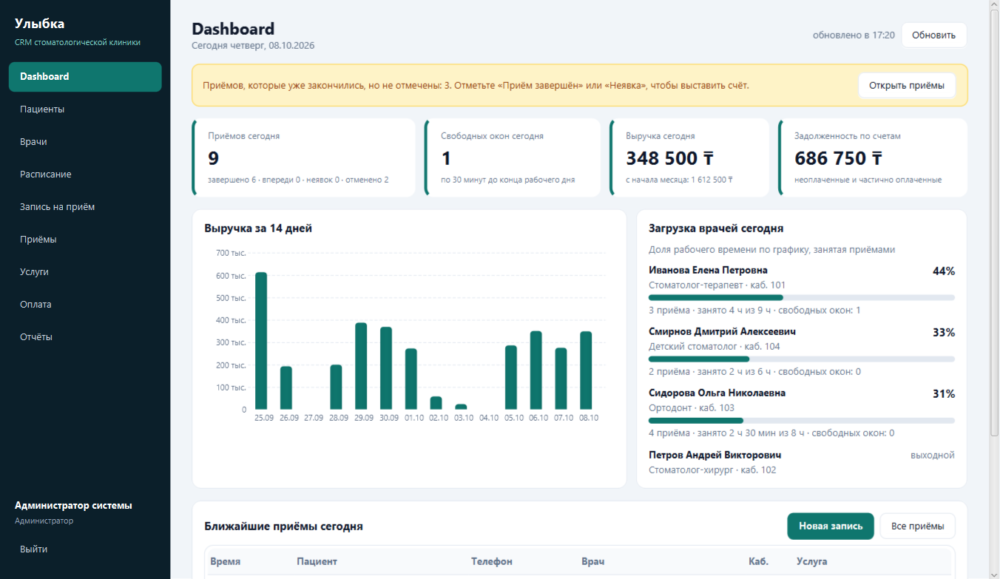

## Стек

- **Java 21**
- **JavaFX 21** — настольный клиент (FXML + единая CSS-тема)
- **Spring Boot 3** — REST API
- **Spring Data JPA / Hibernate** — доступ к данным
- **PostgreSQL** — СУБД, миграции через **Flyway**
- **Log4j2** — журналирование сервера и клиента
- **React 19 + TypeScript + Vite** — сайт онлайн-записи (`web/`), собирается вместе с сервером
- **Claude (Anthropic Messages API)** — ИИ-менеджер в чате сайта и Telegram, вызов инструментов
- **JUnit 5**, **Mockito**, **AssertJ**, **Vitest** — модульные тесты

## Архитектура

```
JavaFX-клиент  ──HTTP/JSON──▶  Spring Boot API  ──JPA──▶  PostgreSQL
   (client/)                      (backend/)  ──HTTPS──▶  Claude API
                                     ▲    ▲
Сайт на React  ──/api/public/**──────┘    └── long polling ── Telegram Bot API
   (web/)
```

- `backend/` — сервер: сущности, бизнес-логика, REST-контроллеры, миграции БД; он же отдаёт собранный сайт.
- `client/` — настольное приложение JavaFX, обращается к серверу по HTTP.
- `web/` — сайт онлайн-записи для пациентов, работает с публичной частью API без входа в систему.

## Требования

- JDK 21 (например, Eclipse Temurin)
- PostgreSQL 14+ (локально)
- Maven ставить не нужно — используется Maven Wrapper (`mvnw` / `mvnw.cmd`)

## Запуск

1. Создать базу данных:

   ```sql
   CREATE DATABASE stomatologia;
   ```

2. Запустить сервер (схема и справочники создаются автоматически через Flyway):

   ```powershell
   $env:DB_PASSWORD="ваш_пароль_postgres"
   .\mvnw.cmd -pl backend spring-boot:run
   ```

   Проверка: <http://localhost:8080/actuator/health>

3. Запустить клиент (в отдельном терминале):

   ```powershell
   .\mvnw.cmd -pl client javafx:run
   ```

4. Сайт онлайн-записи открывается по адресу <http://localhost:8080/>. Его собирает `.\mvnw.cmd verify`
   (Node.js Maven скачивает сам в `web/node/`); без сборки сайта сервер работает как раньше, только без страниц.

Переменные окружения сервера перечислены в [`.env.example`](.env.example). Вместо переменных их можно
записать в файл `.env` в корне проекта — сервер читает его сам, а git его игнорирует, поэтому ключи
и пароли не попадут в репозиторий.

## Тесты и журналы

```powershell
.\mvnw.cmd verify
```

Собирает сайт и запускает модульные тесты всех модулей: JUnit 5 для сервера и клиента, Vitest для сайта.
База данных для тестов не нужна (репозитории подменяются Mockito). Собрать только Java-часть без сайта:
`.\mvnw.cmd verify -Dskip.web=true`.

- **Сервер** — правила записи (двойная запись врача, кабинета и пациента, график врача, прошедшее время),
  права ролей, отмена с освобождением слота и записью в журнал аудита, оплата (частичная, переплата,
  аннулирование), сумма прописью, документы Word и Excel, JWT; ИИ-менеджер — формат запросов к Claude
  и разбор ответов (с подставным HTTP-сервером), инструменты, сценарии разговора на подставной модели,
  передача оператору, обработка сообщений Telegram.
- **Клиент** — форматирование сумм и дат, построение запросов к API, доступ к разделам меню по ролям,
  наличие разметки FXML для каждого экрана, сессия пользователя.

Журналы ведёт Log4j2:

| Где | Файл | Что пишется |
|-----|------|-------------|
| Сервер | `logs/backend.log` (каталог задаётся `LOG_DIR`) | входы в систему, создание, перенос и отмена записей, смена статусов, счета и оплаты, отчёты, отказы с кодом ответа |
| Сервер | `logs/errors.log` | только предупреждения и ошибки: неудачные входы, отказы по правам, сбои |
| Клиент | `~/.stomatologia/logs/client.log` | запуск, вход и выход, каждый запрос к серверу с кодом ответа и временем, сохранённые документы, ошибки |

Файлы журналов ротируются по дням и по размеру, старые сжимаются в `.gz`.

## Демо-учётные записи

При первом запуске пустая БД заполняется учебными данными (отключается `DEMO_DATA=false`).

| Роль | Логин | Пароль | Рабочее место |
|------|-------|--------|---------------|
| Администратор | `admin` | `admin123` | все разделы, управление справочниками |
| Регистратор | `registrar` | `reg123` | пациенты, запись, приёмы, оплата, отчёты |
| Врач | `ivanova`, `petrov`, `sidorova`, `smirnov` | `doc123` | свои приёмы, расписание, пациенты |
| Пациент | `patient` | `pat123` | запись на приём, свои приёмы и счета |

## Экраны

| | |
|---|---|
| 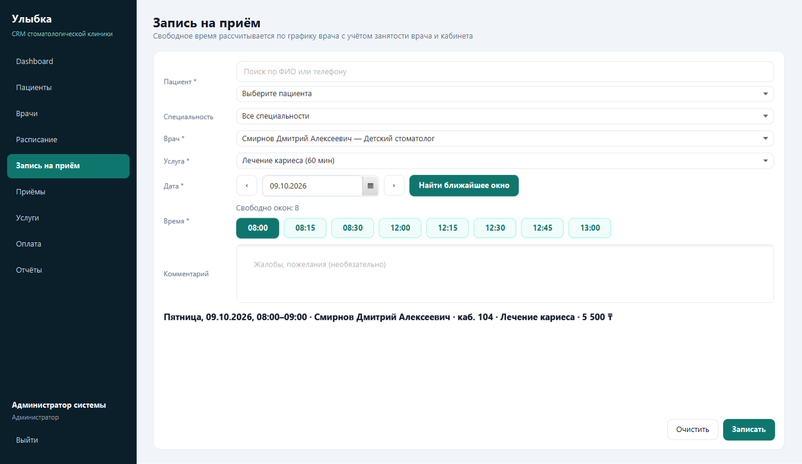 Запись на приём: свободные окна по графику врача, поиск ближайшего окна | 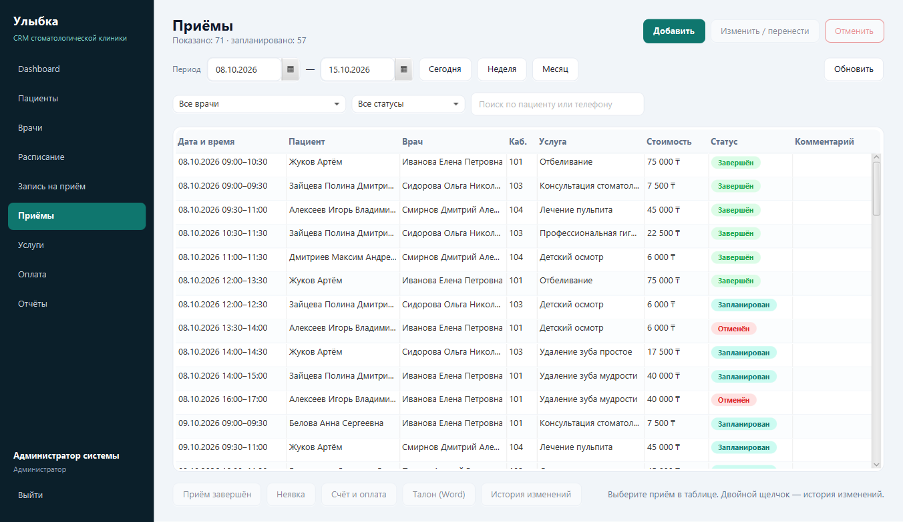 Приёмы: фильтры, статусы, перенос, отмена, талон |
| 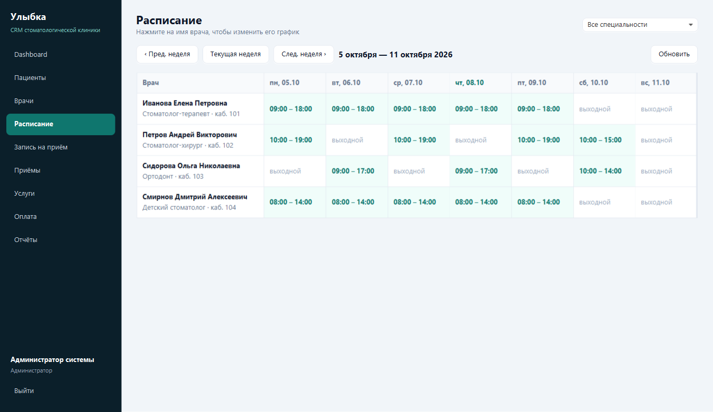 Расписание врачей на неделю | 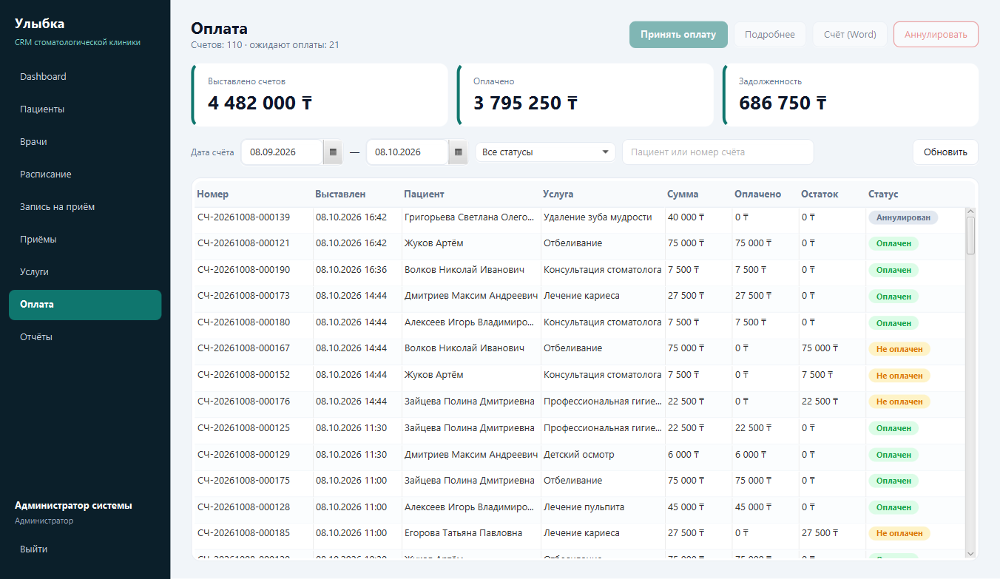 Счета и оплата |
| 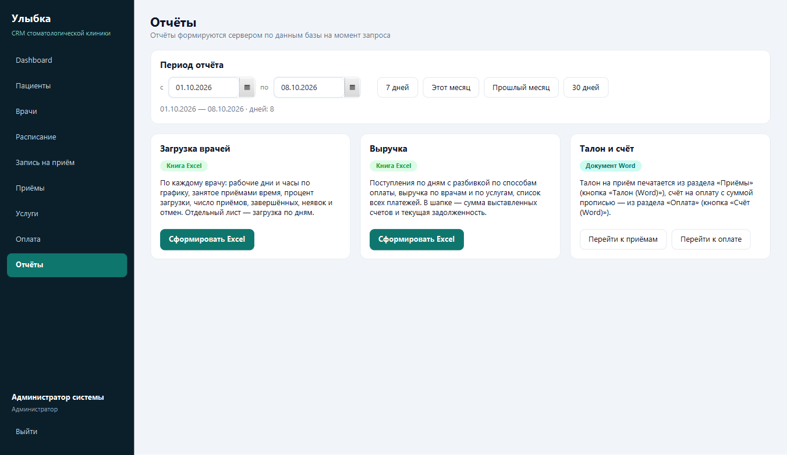 Отчёты Excel за период | 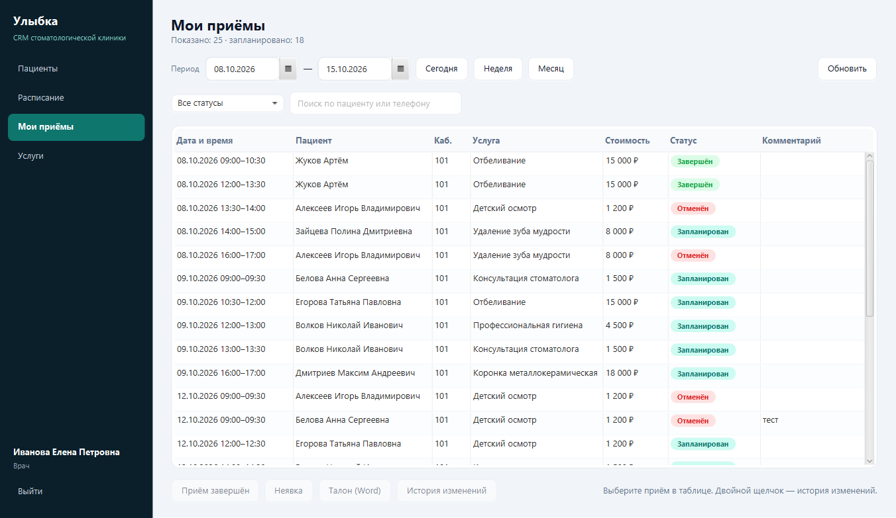 Рабочее место врача — только свои приёмы |
| 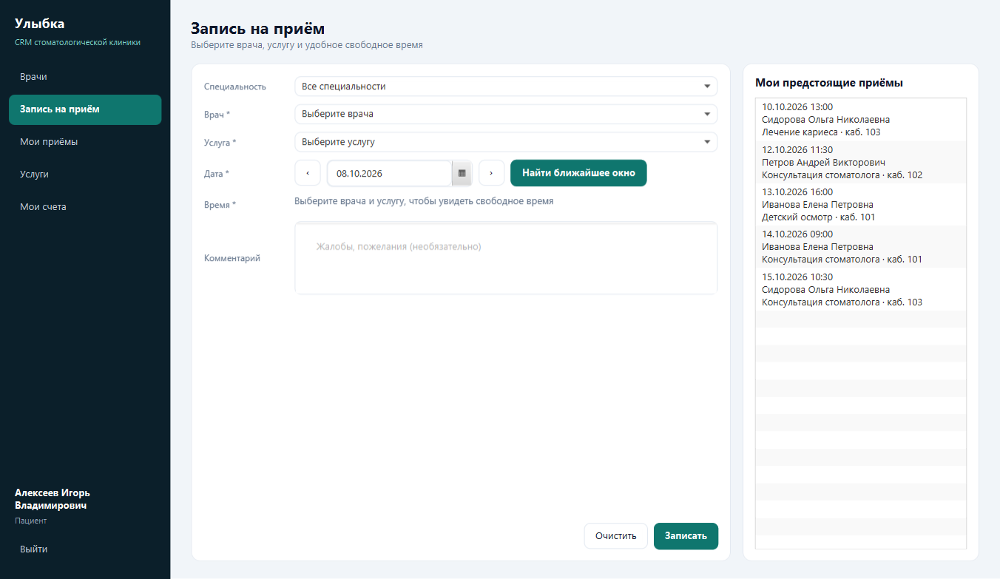 Личный кабинет пациента: самостоятельная запись | 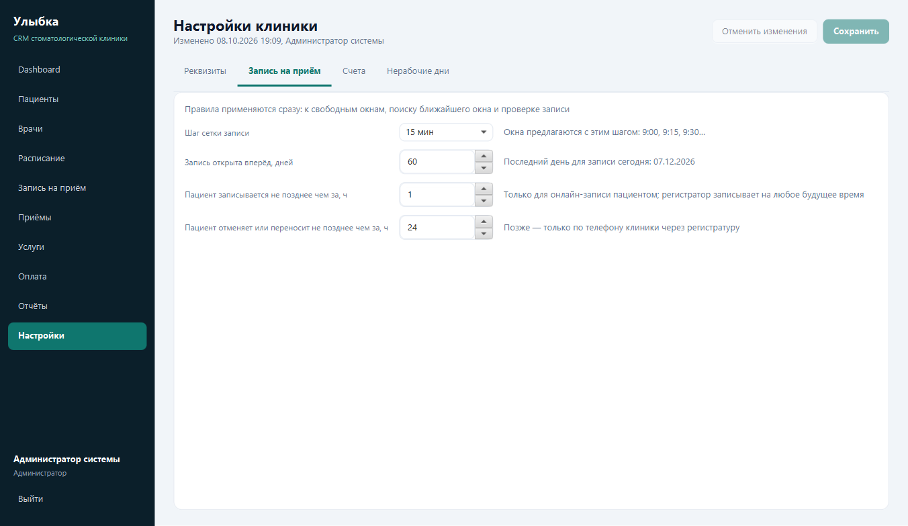 Настройки клиники: правила записи |
| 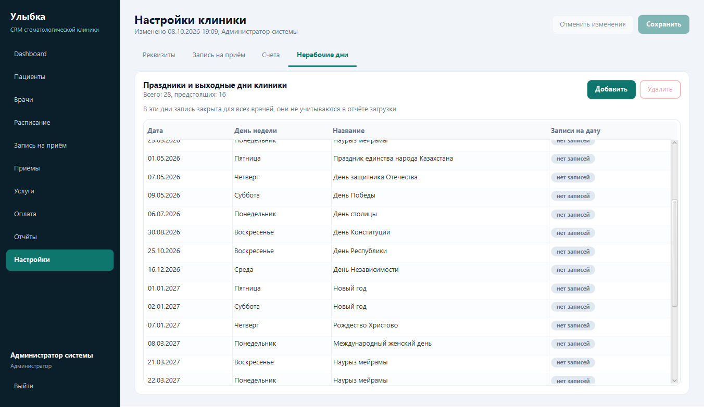 Нерабочие дни клиники | 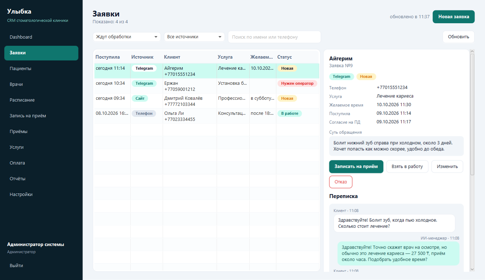 Заявки из мессенджеров, с сайта и по телефону: переписка и запись по заявке |
| 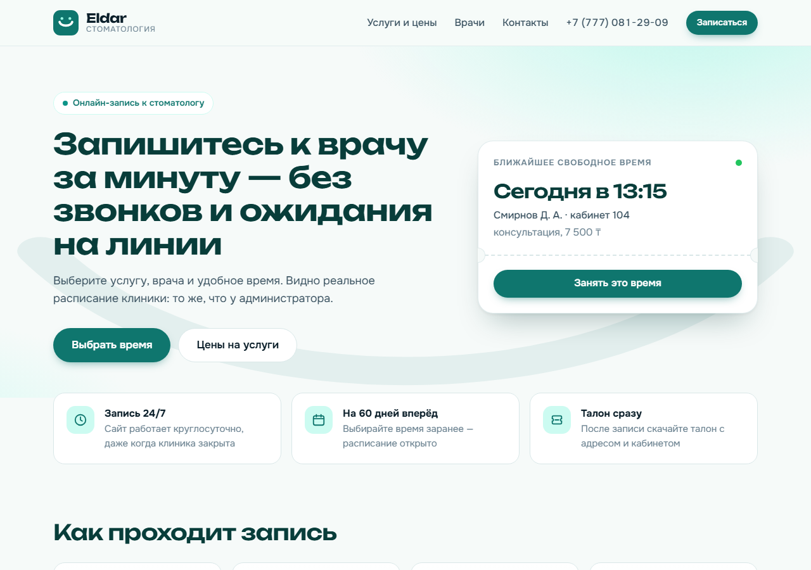 Сайт: ближайшее свободное время в реальном расписании | 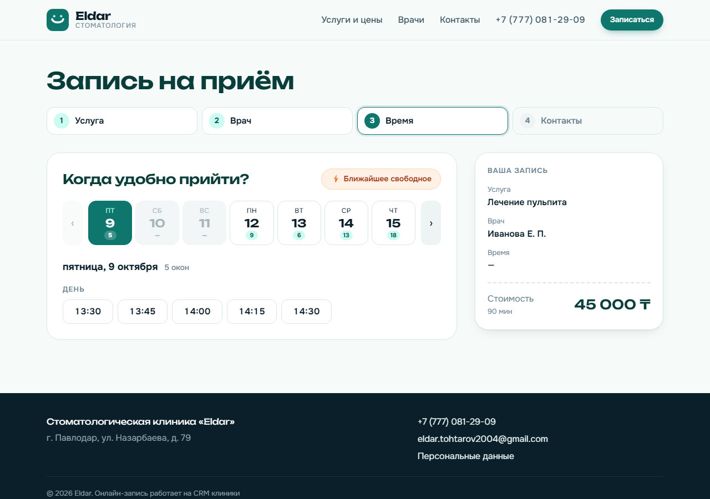 Сайт: запись в 4 шага, свободные окна по дням |
| 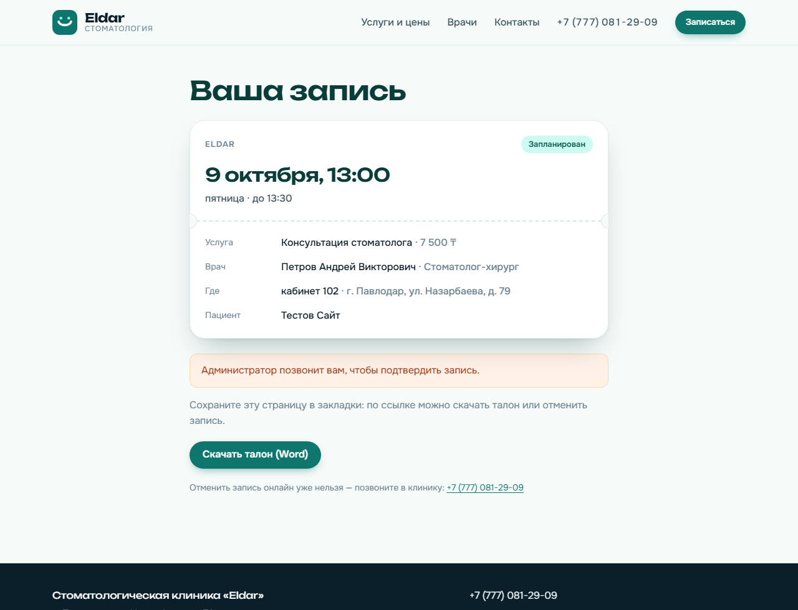 Сайт: страница записи с талоном и отменой | 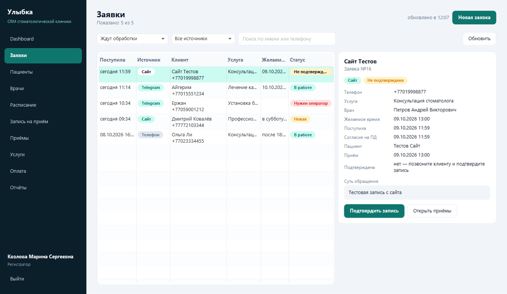 Онлайн-запись в «Заявках»: подтверждение звонком |
| 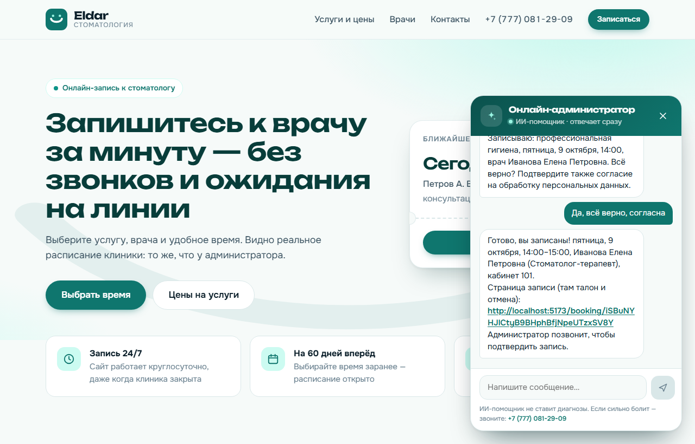 ИИ-менеджер в чате сайта: цены, свободное время и запись | 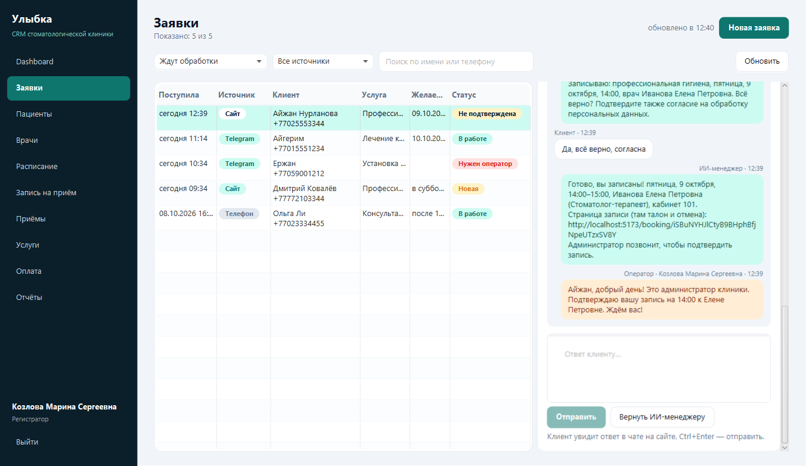 Переписка в «Заявках»: ответ оператора и «Вернуть ИИ-менеджеру» |

## Ход работы

| Этап | Содержание |
|------|------------|
| 1 | Каркас проекта: модули сервера и клиента, схема БД, справочники, CI |
| 2 | Авторизация по JWT, роли, API врачей и пациентов, экран входа и главное меню по ролям |
| 3 | Справочники: услуги, кабинеты, специальности, расписание; экраны «Пациенты», «Врачи», «Расписание», «Услуги» |
| 4 | Запись на приём и список приёмов: свободные окна, поиск ближайшего окна, перенос, отмена, статусы, журнал изменений |
| 5 | Счета и оплата: автоматический счёт при завершении приёма, предоплата, частичная оплата, экран «Оплата» |
| 6 | Dashboard: приёмы сегодня, свободные окна, выручка, задолженность, загрузка врачей — всё по данным БД |
| 7 | Отчёты: талон на приём и счёт в Word, загрузка врачей и выручка за период в Excel |
| 8 | Доработка интерфейса, скриншоты и описание в README |
| 9 | Настройки клиники: реквизиты, правила записи, счета и НДС, нерабочие дни |
| 10 | Заявки: единый список обращений из мессенджеров, с сайта и по телефону, запись по заявке, источник записи, показатели на Dashboard |
| 11 | Сайт онлайн-записи: публичный API, запись без входа в 4 шага, ссылка на запись с талоном и отменой, подтверждение онлайн-записей в CRM, защита от ботов |
| 12 | ИИ-менеджер на Claude: чат на сайте и Telegram-бот отвечают о ценах и врачах, подбирают время и записывают; передача разговора оператору и ответ из CRM |

Следующие этапы — WhatsApp и публикация — описаны в [плане развития](docs/roadmap.md).

## Соответствие ТЗ

| Требование | Реализация |
|------------|------------|
| Роли ADMIN, DOCTOR, REGISTRAR, PATIENT | JWT, `@PreAuthorize` на сервере, меню и кнопки клиента по роли |
| Сущности User, Doctor, Patient, Specialty, Appointment, Service, Invoice, Payment, Room, Schedule | JPA-сущности, схема — миграции Flyway |
| Авторизация, Dashboard, пациенты, врачи, расписание, запись, приёмы, услуги, оплата, отчёты | отдельный экран клиента на каждый раздел |
| Нет двойной записи врача и кабинета | проверка в сервисе + ограничения `EXCLUDE` в PostgreSQL |
| Поиск ближайшего свободного окна | кнопка «Найти ближайшее окно», `GET /api/slots/nearest` |
| Отмена освобождает слот | отменённые приёмы не участвуют в проверке пересечений |
| Аудит изменений записи | таблица `appointment_audit`, кнопка «История изменений» |
| Word: талон или счёт; Excel: загрузка и выручка | Apache POI, раздел «Отчёты» |
| Единый стиль, «Добавить / Изменить / Удалить / Отменить», поиск и фильтры | общая CSS-тема, одинаковая панель кнопок на экранах |
| Ошибки через Alert / Dialog | все ошибки сервера показываются диалогом с понятным текстом |

## Правила записи на приём

- Свободное время считается по графику врача и длительности выбранной услуги с шагом из настроек
  (по умолчанию 15 минут); нерабочие дни клиники пропускаются.
- Двойная запись запрещена: врач и кабинет не могут быть заняты пересекающимися приёмами.
  Проверка выполняется в сервисе (понятное сообщение пользователю) и дублируется ограничениями
  `EXCLUDE` в PostgreSQL (`no_doctor_overlap`, `no_room_overlap`), которые не учитывают отменённые приёмы.
  Пациента тоже нельзя записать к двум врачам на одно время.
- «Найти ближайшее окно» ищет первое свободное время у выбранного врача или у любого врача в пределах
  горизонта записи (по умолчанию 60 дней).
- Отмена переводит приём в статус «Отменён», и его время сразу снова становится свободным.
- Каждое создание, изменение, перенос, отмена и смена статуса записывается в журнал
  (`appointment_audit`): кто, когда, что было и что стало. Журнал открывается кнопкой «История изменений».
- Отметить «Приём завершён» или «Неявка» можно только после начала приёма; врач — только для своих приёмов.

## Счета и оплата

- Счёт выставляется на стоимость услуги автоматически, когда приём отмечен как завершённый.
  Регистратор может выставить счёт и заранее — кнопкой «Счёт и оплата» в списке приёмов (предоплата).
- Оплата принимается целиком или частями (наличные, карта, перевод); статус счёта — «Не оплачен»,
  «Оплачен частично», «Оплачен» — пересчитывается по сумме платежей. Переплата не допускается.
- Отмена приёма или неявка аннулирует счёт, если по нему ещё не было оплаты. При смене услуги в записи
  сумма открытого счёта меняется вместе с ценой.
- Аннулировать счёт вручную может только администратор и только без оплат. Пациент видит свои счета в разделе «Мои счета».

## Dashboard

Главный экран администратора и регистратора; данные считаются сервером по БД при каждом открытии
и обновляются раз в минуту:

- **Приёмов сегодня** — все неотменённые приёмы дня с разбивкой по статусам; отдельно предупреждение
  о приёмах, которые закончились, но не отмечены.
- **Свободных окон сегодня** — число свободных 30-минутных окон до конца рабочего дня по графикам врачей
  с учётом занятости врача и кабинета.
- **Выручка** — сумма фактических платежей за сегодня и с начала месяца, график за 14 дней.
- **Задолженность** — остаток по неоплаченным и частично оплаченным счетам.
- **Загрузка врачей** — доля рабочего времени по графику, занятая приёмами (без отменённых).
- **Заявки ждут обработки** — открытые заявки, новые за сегодня и доля заявок за 30 дней, которые
  дошли до записи; по щелчку открывается раздел «Заявки».

## Заявки

Раздел «Заявки» (администратор и регистратор) собирает в одном списке обращения, которые ещё не стали
записью: из Telegram и чата на сайте (их оформляет ИИ-менеджер), с сайта и звонки, которые регистратор
вносит сам кнопкой «Новая заявка». Схема — миграция V5 (таблицы `leads`, `conversations`, `chat_messages`).

| Статус | Что значит |
|--------|------------|
| Новая | поступила, никто ещё не взял |
| В работе | регистратор связывается с клиентом |
| Нужен оператор | бот передал разговор человеку |
| Записан | по заявке создан приём |
| Отказ | закрыта без записи, с причиной; можно вернуть в работу |

- По умолчанию показываются заявки, ждущие обработки; есть фильтры по статусу и источнику и поиск по
  имени или телефону. Список обновляется раз в 30 секунд.
- Справа — карточка заявки: контакты, услуга, желаемое время, суть обращения и переписка с клиентом.
- «Записать на приём» ищет пациентов с тем же телефоном (по последним 10 цифрам, формат номера не важен)
  и предлагает выбрать карту или завести новую — имя и телефон берутся из заявки. Врач, услуга и время,
  которые выбрал клиент, подставляются в форму записи. Приём создаётся через ту же проверку, что
  и обычная запись: двойная запись, нерабочие дни и горизонт записи. После записи можно сразу скачать талон.
- У каждого приёма теперь хранится источник: регистратура, личный кабинет, сайт или мессенджер.

## Сайт онлайн-записи

Сайт для пациентов (`web/`, React + TypeScript) открывается по адресу <http://localhost:8080/> — его отдаёт
тот же сервер. Название, адрес и телефон клиники, услуги, цены и врачи берутся из CRM, а свободное время —
из того же расчёта окон, что и в форме записи у регистратора, поэтому двойной записи не бывает.

- **Главная** — карточка «Ближайшее свободное время» на консультацию с кнопкой «Занять это время».
- **Услуги и цены**, **Врачи** — из справочников; с любой услуги или врача можно сразу перейти к записи.
- **Запись в 4 шага**: услуга → врач или «любой свободный» → день и время (лента дней с числом свободных окон,
  нерабочие дни и даты за горизонтом недоступны, кнопка «Ближайшее свободное») → фамилия, имя, телефон
  с маской, комментарий и согласие на обработку персональных данных.
- **Страница записи** по личной ссылке `/booking/<токен>`: дата, врач, кабинет, адрес, «Скачать талон (Word)»
  и «Отменить запись» — до срока отмены из «Настроек», позже сайт предлагает позвонить.
- Пациент с той же фамилией, именем и телефоном находится в базе, иначе заводится новая карта.
  Для онлайн-записи действует правило минимального времени до приёма, как в личном кабинете пациента.
- В CRM онлайн-запись появляется в «Заявках» со статусом **«Не подтверждена»** и считается ждущей обработки,
  пока регистратор не позвонит клиенту и не нажмёт «Подтвердить запись». На сайте после этого видно, что
  запись подтверждена. Если клиент отменил запись по ссылке, приём отменяется, а заявка закрывается отказом.

Защита публичного API `/api/public/**`:

| Мера | Значение |
|------|----------|
| Лимит запросов с одного адреса | 120 чтений в минуту и 10 записей в час (`app.public-api.*`), сверх — ответ 429 |
| Онлайн-записей на один телефон | не больше 2 предстоящих, дальше — запись по телефону клиники |
| Скрытое поле-ловушка | заполненное поле `website` выдаёт бота, запрос отклоняется |
| Сообщения в чат | 60 в час с одного адреса (`app.public-api.chat-messages-per-hour`), до 1000 символов |
| Ссылка на запись | случайный токен из 32 символов, по нему видна только своя запись |
| Остальное API | закрыто, как и раньше: без входа сервер отвечает 401 |

Капча Cloudflare Turnstile подключается при публикации сайта (этап 13).

Разработка сайта с горячей перезагрузкой — при запущенном сервере:

```powershell
cd web
npm install
npm run dev   # http://localhost:5173, запросы /api уходят на localhost:8080
```

Тексты интерфейса вынесены в `web/src/i18n/ru.ts` — казахская версия добавляется файлом с той же структурой.

## ИИ-менеджер

Клиент пишет в чат на сайте (кнопка «Задать вопрос» на любой странице) или Telegram-боту — отвечает
модель Claude (по умолчанию `claude-haiku-4-5`, быстрая и недорогая). Модель не знает ничего «из головы»:
цены, врачей и свободное время она получает инструментами из тех же сервисов, что у сайта.

| Инструмент | Что делает |
|------------|------------|
| `get_clinic_info`, `list_services`, `list_doctors` | реквизиты клиники, услуги с ценами, врачи |
| `find_free_slots` | свободные окна на услугу: ближайшие дни или конкретная дата, к врачу или к любому |
| `book_appointment` | запись — после того как клиент подтвердил детали и дал согласие на обработку данных |
| `create_lead` | заявка на обратный звонок, если подходящего времени нет |
| `handoff_to_operator` | передать разговор человеку |

- **Запись как на сайте:** те же проверки расписания и лимиты, заявка «Не подтверждена», клиент получает
  ссылку на страницу записи с талоном и отменой. Источник приёма — «Сайт» для чата и «Мессенджер» для Telegram.
- **Правила в промпте:** коротко и на языке клиента, без диагнозов, при острой боли — позвонить в клинику
  или 103, не спрашивать ИИН и документы. Markdown в ответах вычищается.
- **Защита от ошибок модели:** услугу и врача модель передаёт названием, сервер сам находит их в каталоге
  (неоднозначное название возвращается ей со списком). Если модель пишет «вы записаны», не создав запись,
  или «времени нет», не проверив расписание, сервер возвращает ей ответ на исправление.
- **Заявка на каждое обращение:** первое сообщение заводит заявку в CRM, у каждой заявки своя переписка;
  новое обращение с того же устройства или Telegram — новая заявка без данных прошлой.
- **Передача человеку:** по просьбе клиента, при жалобе, если модель недоступна или клиент написал больше
  60 сообщений за день. Клиент получает ответ «вопрос передан администратору», заявка — статус
  «Нужен оператор», дальше модель в этом разговоре молчит.
- **Ответ из CRM:** в карточке заявки под перепиской — поле ответа и «Отправить» (Ctrl+Enter). Ответ уходит
  в Telegram или появляется в чате сайта (виджет опрашивает сервер каждые 5 секунд), разговор переходит
  к оператору. «Вернуть ИИ-менеджеру» снова включает модель. Переписка в карточке обновляется сама,
  набранный текст не сбрасывается при обновлении списка.
- **Telegram:** бот работает через long polling — публичный адрес сервера не нужен. По `/start` приветствует
  и предлагает кнопку «Поделиться контактом»: подтверждённый номер модель уже не переспрашивает.

Подключение — ключ в `.env` в корне проекта (файл в `.gitignore`):

```properties
ANTHROPIC_API_KEY=ключ из console.anthropic.com
TELEGRAM_BOT_TOKEN=токен от @BotFather   # необязательно
SITE_URL=http://localhost:8080          # адрес сайта для ссылок в ответах
```

Без ключа чат на сайте всё равно работает: каждое обращение сразу становится заявкой «Нужен оператор»,
и регистратор отвечает из CRM. Без токена Telegram-бот просто не запускается. Ответ модели ждётся вне
транзакции БД, а сообщения одного чата обрабатываются по очереди. Схема — миграция V7.

## Отчёты

Документы формирует сервер (Apache POI), клиент сохраняет файл в выбранную папку и открывает его в Word или Excel.

| Документ | Формат | Где сформировать | Кто может |
|----------|--------|------------------|-----------|
| Талон на приём | Word | «Приёмы» → «Талон (Word)», а также сразу после записи | все роли, для доступных им приёмов |
| Счёт на оплату (с суммой прописью и платежами) | Word | «Оплата» → «Счёт (Word)» | администратор, регистратор, пациент — свои счета |
| Загрузка врачей за период | Excel | «Отчёты» | администратор, регистратор |
| Выручка за период | Excel | «Отчёты» | администратор, регистратор |

- **Загрузка врачей**: рабочие дни и часы по графику, занятое приёмами время и процент загрузки, число
  приёмов, завершённых, неявок и отмен; второй лист — загрузка каждого врача по дням.
- **Выручка**: поступления по дням с разбивкой по способам оплаты, выручка по врачам и по услугам,
  список платежей; итоги считаются формулами Excel. Период отчёта — не больше года.
- Реквизиты клиники в документах берутся из раздела «Настройки»; при НДС в счёте выделяется строка
  «в т.ч. НДС».

## Настройки клиники

Раздел «Настройки» доступен только администратору. Значения хранятся в БД (таблицы `clinic_settings`
и `holidays`, миграция V4) и применяются сразу, без перезапуска сервера. Каждое изменение пишется
в журнал сервера: кто изменил и какие поля («было → стало»).

| Вкладка | Что настраивается | Где используется |
|---------|-------------------|------------------|
| Реквизиты | название, адрес, телефон, email, БИН, банк, ИИК, БИК | шапка талона и счёта Word, строка «Получатель» в счёте |
| Запись на приём | шаг сетки (10/15/20/30 мин), на сколько дней вперёд открыта запись, за сколько часов пациент может записаться и отменить запись | свободные окна, поиск ближайшего окна, проверка записи, отмена и перенос пациентом |
| Счета | префикс номера счёта, НДС и его ставка, порог предоплаты | номер счёта, строка НДС в счёте, счёт сразу при записи на дорогую услугу |
| Нерабочие дни | праздники Казахстана на 2026–2027 годы и свои выходные дни клиники | запись закрыта, дни не входят в отчёт загрузки, на Dashboard отмечается праздник |

- Ограничения времени до приёма и срока отмены действуют только для пациента в личном кабинете;
  регистратор записывает и отменяет без них.
- При добавлении нерабочего дня, на который уже есть записи, клиент показывает их число и предлагает
  перейти к приёмам, чтобы перенести их.
- В форме записи нерабочие дни выделены в календаре, а даты за пределами горизонта записи недоступны.
