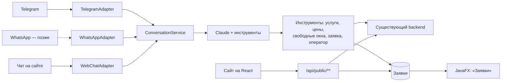

# План развития: заявки, сайт онлайн-записи, ИИ-менеджер

Этапы 1–12 реализованы (см. «Ход работы» в [README](../README.md)). Ниже — план следующих этапов.

Принятые решения:

- сайт онлайн-записи — отдельное приложение на React;
- ИИ-модель — Claude (Anthropic), небольшая модель семейства Haiku; поставщик сменный;
- ИИ-менеджер работает в чате на сайте и в Telegram, WhatsApp подключается позже;
- бот записывает так же, как сайт: сразу занимает время, регистратор подтверждает запись звонком.

## Общая идея

В системе появляется единое понятие **заявки (лида)**. В заявки попадают разговоры, которые ИИ-менеджер
довёл до готовых данных (Telegram, позже WhatsApp), и записи с сайта. Регистратор работает с ними
в новом разделе «Заявки» настольного клиента.

ИИ-менеджер не привязан к мессенджеру: логика разговора одна, а Telegram, WhatsApp и чат на сайте —
сменные адаптеры. Переход с Telegram на WhatsApp — это один новый адаптер без изменения бизнес-логики.

Для пациента обязательны только фамилия и имя (телефон и дата рождения необязательны), поэтому пациента
из заявки или с сайта можно создавать по имени и телефону без изменения схемы.

## Этап 10. Заявки в CRM — реализован

Как работает раздел, описано в README, в разделе «Заявки».

### База данных (миграция V5)

| Таблица | Поля |
|---|---|
| `leads` | источник (TELEGRAM / WHATSAPP / WEBSITE / PHONE), имя, телефон, услуга, желаемый врач, выбранное время или пожелание текстом, краткое описание от ИИ, статус (NEW, IN_PROGRESS, NEEDS_OPERATOR, BOOKED, REJECTED), согласие на обработку данных и время согласия, пациент, приём, кто обработал, даты |
| `conversations` | канал, идентификатор чата во внешней системе, заявка, режим (AI — отвечает бот, OPERATOR — отвечает человек, CLOSED) |
| `chat_messages` | диалог, роль (USER / ASSISTANT / OPERATOR), текст, время |
| `appointments.source` | новая колонка: REGISTRY (регистратура) / PATIENT_ACCOUNT (личный кабинет) / WEBSITE / MESSENGER |

### Сервер

- `LeadService`: список с фильтрами, смена статуса, «Записать» — пациент ищется по нормализованному
  телефону (`+7XXXXXXXXXX`) или создаётся, затем приём создаётся через существующий `AppointmentService`,
  поэтому действуют все проверки: двойная запись, праздники, горизонт записи.
- Каждое действие с заявкой пишется в журнал Log4j2.

### Клиент JavaFX

- Раздел «Заявки» (администратор, регистратор): таблица со статусами-бейджами и фильтром по источнику,
  справа — переписка с клиентом. Кнопки «Записать» (открывает форму записи с заполненными данными),
  «Отказ», «Взять в работу».
- Dashboard: заявок сегодня, необработанных, конверсия в записи.

## Этап 11. Сайт онлайн-записи — реализован

Как работает сайт, описано в README, в разделе «Сайт онлайн-записи».

### Технологии

React 19 + TypeScript + Vite, модуль `web/`. Сборка подключена к Maven через `frontend-maven-plugin`
(Node.js скачивается в `web/node/`), собранный сайт копируется в `static/` сервера, поэтому `mvnw verify`
собирает всё вместе, а сайт открывается на `http://localhost:8080/`. Пути страниц (`/booking/…` и другие)
сервер перенаправляет на `index.html`. В разработке — `npm run dev` с прокси `/api` на `localhost:8080`.
Тексты вынесены в `web/src/i18n/ru.ts` — заготовка под казахский язык.

### Страницы

1. Главная: ближайшее свободное время на консультацию, как проходит запись, популярные услуги, врачи, контакты.
2. Услуги с актуальными ценами и поиском.
3. Врачи и специальности.
4. Запись в 4 шага: услуга → врач или «любой» → день и время (те же окна, что в CRM; праздники и даты
   за горизонтом недоступны, кнопка «Ближайшее свободное») → фамилия, имя, телефон, согласие на обработку данных.
5. Страница записи по личной ссылке: дата, время, врач, кабинет, адрес, «Скачать талон», отмена до срока из «Настроек».

### База данных (миграция V6)

`leads.public_token` — токен личной ссылки на запись, `leads.confirmed_at` — когда регистратор подтвердил
онлайн-запись (записи, созданные в CRM, подтверждены сразу).

### Публичный API (без входа в систему)

| Метод | Назначение |
|---|---|
| `GET /api/public/clinic` | название, адрес, телефон, горизонт записи, срок отмены |
| `GET /api/public/services` | активные услуги и цены |
| `GET /api/public/doctors` | врачи с кабинетом, без личных данных сотрудников |
| `GET /api/public/holidays` | нерабочие дни за период |
| `GET /api/public/slots` | свободные окна на день (`SlotService`), для одного врача или всех |
| `GET /api/public/slots/days` | число свободных окон по дням — для ленты дат |
| `GET /api/public/slots/nearest` | ближайшее свободное окно |
| `POST /api/public/bookings` | запись: приём с источником WEBSITE и заявка «не подтверждена» |
| `GET /api/public/bookings/{token}` | своя запись по токену |
| `GET /api/public/bookings/{token}/ticket` | талон Word |
| `POST /api/public/bookings/{token}/cancel` | отмена с учётом срока из «Настроек» |

В CRM: статус «Не подтверждена» в «Заявках», кнопка «Подтвердить запись» (`POST /api/leads/{id}/confirm`),
неподтверждённые онлайн-записи входят в показатель «Заявки ждут обработки» на Dashboard.

### Защита

- Лимит запросов с одного адреса (свой фильтр с фиксированным окном, без сторонних библиотек):
  120 чтений в минуту, 10 записей в час, сверх — 429 с заголовком `Retry-After`.
- Не больше 2 предстоящих онлайн-записей на один телефон; скрытое поле-ловушка для ботов.
- Сайт отдаётся с того же адреса, что и API, поэтому CORS не открывается; публичный API не отдаёт данных
  о других пациентах, своя запись доступна только по случайному токену.
- Одновременные запросы на одно время отсекает ограничение `EXCLUDE` в PostgreSQL.
- **Отложено до публикации (этап 13):** капча Cloudflare Turnstile на форме записи.

С сайта запись создаётся сразу: человек выбирает реально свободное время и получает подтверждение.
Подтверждение телефона кодом добавляется вместе с WhatsApp (дешевле SMS).

## Этап 12. ИИ-менеджер: чат на сайте и Telegram — реализован

Описание того, как это работает, — в разделе «ИИ-менеджер» [README](../README.md). Схема — миграция V7
(имя и подтверждённый телефон клиента в разговоре).

### Каналы

- **Чат на сайте** — виджет на всех страницах сайта, работает через публичный API со своим лимитом сообщений.
- **Telegram** — бот создаётся через @BotFather бесплатно. Long polling: сервер сам забирает сообщения,
  публичный адрес не нужен, всё работает на `localhost`. Телефон клиент отправляет кнопкой
  «Поделиться контактом» — номер приходит подтверждённым Telegram. Бот включается, когда задан `TELEGRAM_BOT_TOKEN`.

### Claude

Небольшая модель семейства Haiku с вызовом инструментов, запросы идут напрямую в Messages API Anthropic.
Модель задаётся `ANTHROPIC_MODEL`, ключ — `ANTHROPIC_API_KEY`. Ключи хранятся в переменных окружения
или в локальном файле `.env`, который git не отслеживает. Логика разговора не зависит от поставщика:
клиент модели — один класс за интерфейсом `ChatModel`. В запрос передаются инструкция и последние
20 сообщений диалога. Модель не знает цен и расписания — всё берётся из инструментов:

| Инструмент | Источник данных |
|---|---|
| `get_clinic_info` | «Настройки»: адрес, телефон, правила отмены |
| `list_services` | справочник услуг и цены |
| `list_doctors` | врачи и специальности |
| `find_free_slots(service, doctor?, date?)` | `SlotService` с учётом праздников и шага записи |
| `book_appointment(service, doctor?, start, name, phone, consent)` | запись как с сайта: приём и заявка «не подтверждена» |
| `create_lead(name, phone, service?, wish, summary, consent)` | заявка на звонок, если подходящего времени нет |
| `handoff_to_operator(reason)` | режим OPERATOR, заявка «Нужен оператор» |

### Пример диалога

> — Здравствуйте, болит зуб, сколько стоит лечение?
> — Лечение кариеса — 27 500 ₸. Ближайшее время у терапевта: завтра 10:00, 11:30 или 15:00. Какое удобнее?
> — 11:30
> — Как вас зовут? Нажмите «Поделиться контактом», чтобы мы могли подтвердить запись. Отправляя данные, вы соглашаетесь на их обработку.
> — *(контакт)* Игорь
> — Готово, Игорь! Вы записаны на завтра в 11:30 к терапевту, кабинет 101. Администратор позвонит, чтобы подтвердить запись.

### Правила для модели

- Отвечать на языке клиента (русский или казахский).
- Никаких диагнозов и назначений. При отёке, температуре, кровотечении, травме — телефон клиники или 103.
- Просьба позвать человека, вопрос не по теме или неуверенность — `handoff_to_operator`.
- Не спрашивать ИИН и историю болезни, не передавать их в модель.
- Модель недоступна, не ответила вовремя или ключ не задан — клиенту «Администратор скоро ответит»,
  диалог переходит к человеку.

### Режим работы

Бот записывает так же, как сайт: `book_appointment` проходит все проверки расписания и сразу занимает
время, а в «Заявках» появляется запись «Не подтверждена» — регистратор перезванивает и подтверждает.
Действует тот же лимит: не больше 2 предстоящих онлайн-записей на телефон.

Ответ оператора: регистратор пишет прямо из карточки заявки в CRM, сообщение уходит клиенту в тот же
канал (Telegram или чат на сайте), а бот замолкает. Кнопка «Вернуть ИИ-менеджеру» снова включает бота.

### Тесты

- Клиент Anthropic — сборка запроса и разбор ответа; повтор при перегрузке — на локальном подставном сервере.
- Инструменты тестируются отдельно.
- `ConversationService` — с подменённой моделью по сценариям («модель вызвала `book_appointment` —
  появилась запись»). Настоящая модель в тестах не вызывается: бесплатно, предсказуемо, CI без ключа.

## Этап 13. WhatsApp, уведомления, публикация

- **WhatsApp Cloud API**: `WhatsAppAdapter`, webhook `POST /api/channels/whatsapp` с проверкой подписи Meta.
  Используется только официальный API: неофициальные сервисы на основе WhatsApp Web приводят к блокировке номера.
- **Уведомления**: подтверждение записи и напоминание за день. В WhatsApp такие сообщения отправляются
  только по одобренным шаблонам и платно; ответы в течение 24 часов после сообщения клиента бесплатны.
- **Публикация**: VPS у казахстанского хостинга (закон РК требует хранить базы персональных данных
  на территории страны), домен `.kz`, Docker Compose (backend, PostgreSQL, Nginx со статикой сайта),
  HTTPS через Let's Encrypt. JavaFX-клиент подключается через настройку `api.url`.
- **Капча Cloudflare Turnstile** на форме записи сайта (ключи выдаются на домен) и лимит запросов
  с учётом заголовка `X-Forwarded-For` от Nginx.

## Персональные данные

- Согласие на обработку собирается до сохранения данных (галочка на сайте, вопрос в мессенджере),
  время согласия хранится в заявке.
- В ИИ-модель передаётся минимум данных: без ИИН и истории лечения.
- Хранение базы — на сервере в Казахстане.

## Что понадобится

| Этап | Что нужно |
|---|---|
| 11 | ничего: Node.js для сборки сайта Maven скачивает сам |
| 12 | ключ API Anthropic, токен Telegram-бота от @BotFather |
| 13 | аккаунт Meta Business и номер для WhatsApp, VPS и домен |

## Порядок

| Этап | Объём | Внешние сервисы |
|---|---|---|
| 10. Заявки в CRM | средний | не нужны |
| 11. Сайт на React | большой | не нужны |
| 12. ИИ-менеджер в Telegram и чат на сайте | большой | Anthropic, Telegram |
| 13. WhatsApp, напоминания, публикация | средний | Meta, хостинг |
